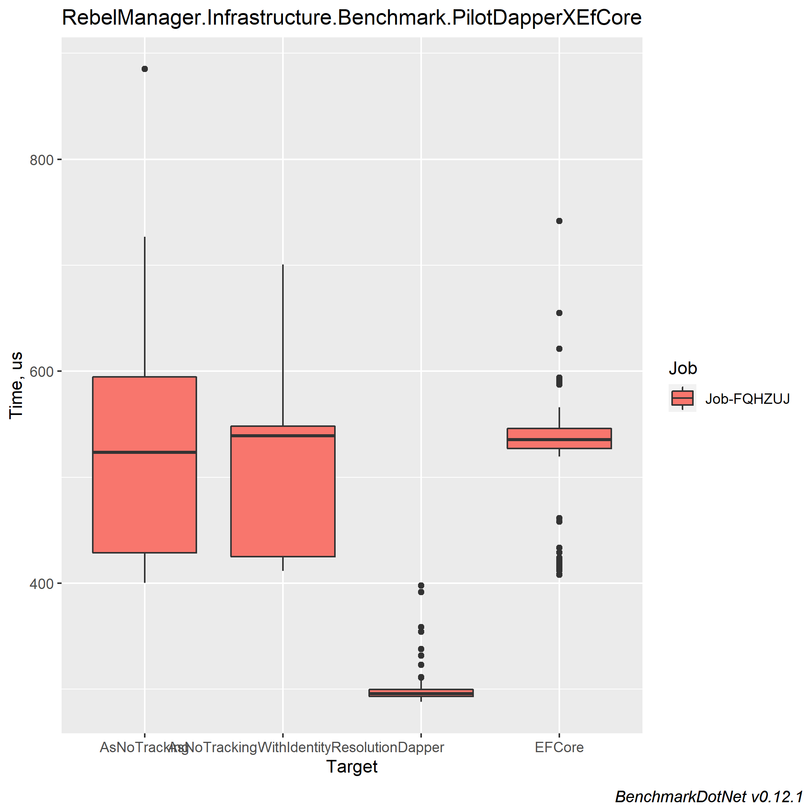
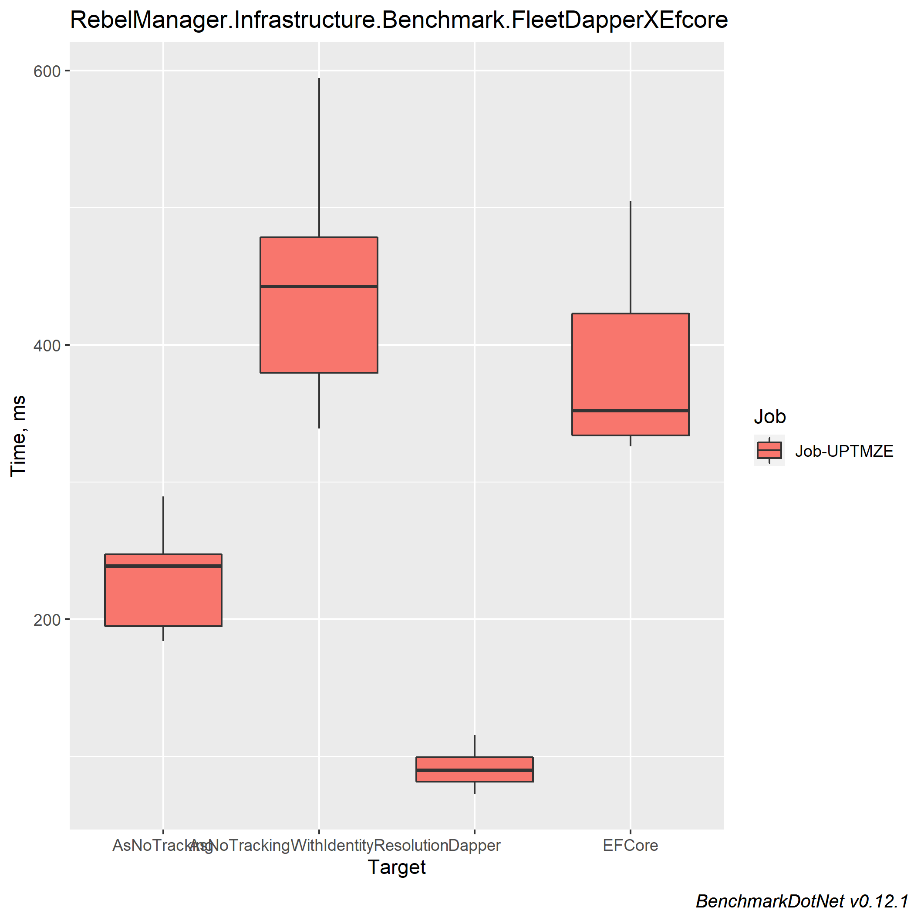

# RebelManager
## Table of contents
* [General Info](#general-info)
* [Features](#features)
* [Results](#results)

##  General Info
> Dotnet sandbox project to study backend technologies

##  Features
* Dapper
* EFCore
* Benchmarkdotnet for Dapper x EFCore comparison
* API Versioning
* Bogus for creating mock data
* Mediator pattern

##  Results
Results were obtained using Benchmarkdotnet, GetAllFleets return all fleets with ships and pilots. GetPilot return only the pilot  

  
>BenchmarkDotNet=v0.12.1, OS=Windows 10.0.19042 
Intel Core i7-7500U CPU 2.70GHz (Kaby Lake), 1 CPU, 4 logical and 2 physical cores 
.NET Core SDK=5.0.102 
  [Host]     : .NET Core 3.1.11 (CoreCLR 4.700.20.56602, CoreFX 4.700.20.56604), X64 RyuJIT 
  Job-FQHZUJ : .NET Core 3.1.11 (CoreCLR 4.700.20.56602, CoreFX 4.700.20.56604), X64 RyuJIT 
OutlierMode=DontRemove  InvocationCount=500  RunStrategy=Throughput
UnrollFactor=1   

### GetPilot Benchmark
Method	| Mean	| Error	| StdDev | Median | Ratio | RatioSD	| Rank	| Gen 0	| Gen 1	| Gen 2	| Allocated
--- | --- | --- | ---  | --- | --- | --- | --- | --- | --- | --- | --- |
 Dapper | 300.6 μs | 5.99 μs | 17.67 μs | 295.7 μs | 0.59 | 0.09 | * | 4.0000 | - |	- |8.25 KB
EFCore | 520.8 μs | 19.78 μs | 58.34 μs | 535.6 μs | 1.00 | 0.00 | ** | 20.0000 | - | - | 44.41 KB
AsNoTracking | 518.3 μs	| 32.82 μs | 96.78 μs | 523.6 μs | 1.01	| 0.23 | **	|20.0000 | - | - | 43.31 KB
AsNoTrackingWithIdentityResolution | 504.1 μs | 24.46 μs | 72.11 μs	| 539.3 μs |0.99 | 0.22 | ** | 22.0000 | - | - | 45.36 KB
 

### GetAllFleet Benchmark

>BenchmarkDotNet=v0.12.1, OS=Windows 10.0.19042 
Intel Core i7-7500U CPU 2.70GHz (Kaby Lake), 1 CPU, 4 logical and 2 physical cores 
.NET Core SDK=5.0.102 
  [Host]     : .NET Core 3.1.11 (CoreCLR 4.700.20.56602, CoreFX 4.700.20.56604), X64 RyuJIT 
  Job-UPTMZE : .NET Core 3.1.11 (CoreCLR 4.700.20.56602, CoreFX 4.700.20.56604), X64 RyuJIT 
InvocationCount=2  RunStrategy=Throughput  UnrollFactor=1   

Method	| Mean	| Error	| StdDev | Median | Ratio | RatioSD	|  Gen 0	| Gen 1	| Gen 2	| Allocated
--- | --- | --- | ---  | --- | --- | --- | --- | --- |  --- | --- |
 Dapper | 90.90 ms | 3.827 ms | 11.10 ms | 89.77 ms | 0.25 | 0.05 | 2000.0000 | 500.0000 |	- |13.1 MB
 EFCore | 376.15 ms | 16.153 ms | 47.37 ms | 352.01 ms | 1.00 | 0.00 | 7000.0000 | 2500.0000 | 1000.0000 | 42 MB
AsNoTracking | 225.07 ms | 9.051 ms | 26.54 ms | 238.63 ms | 0.61 | 0.09 | 4500.0000 | 1500.0000 | 500.0000	 | 23.71 MB
AsNoTrackingWithIdentityResolution | 437.17 ms | 21.868 ms | 62.74 ms | 442.56 ms | 1.19 | 0.23 | 7500.0000 | 2500.0000 | 1000.0000 | 44.17 MB
